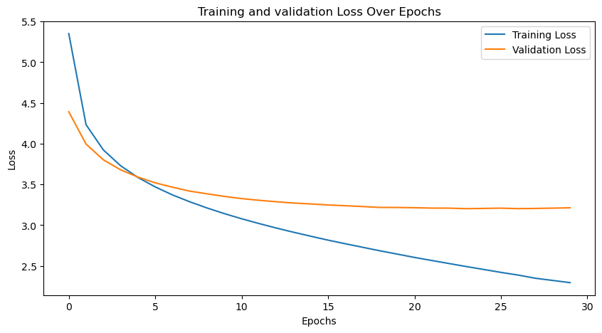
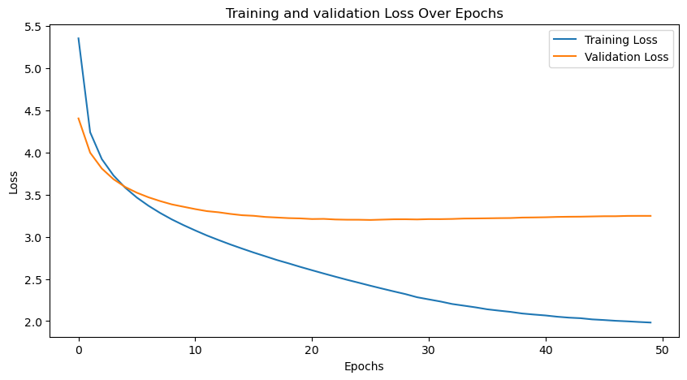
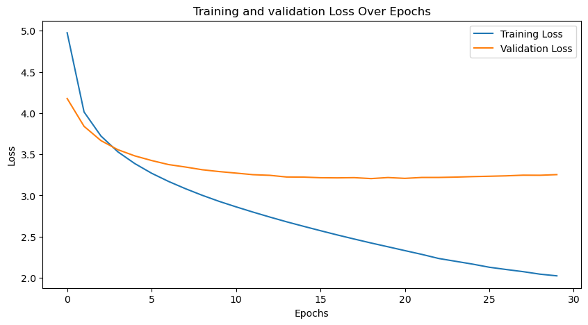
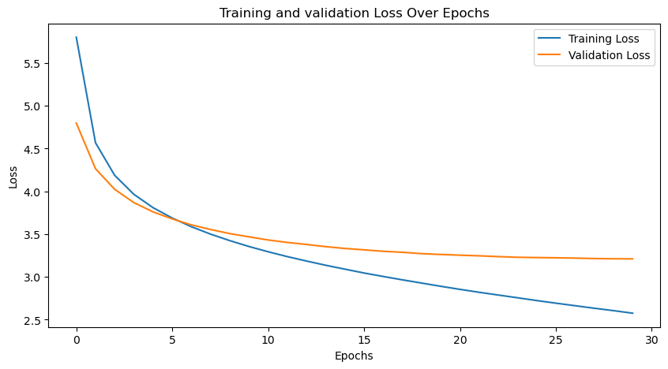
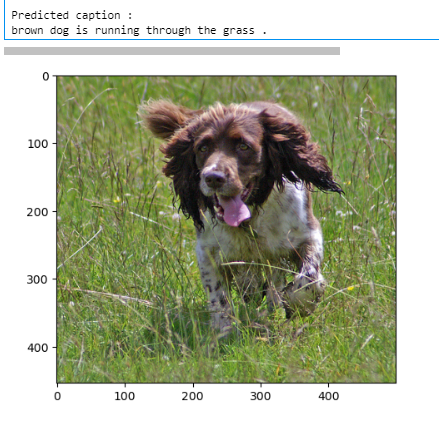

# Rapport de mini-projet : Génération automatique de descriptions d'images à l'aide réseau ResNet et d'un Transformers

## Introduction

La génération automatique de descriptions d'images est une tâche complexe qui implique la compréhension de contenu visuel et la production de texte descriptif. Ce projet vise à explorer l'utilisation d'un réseau ResNet (encodeur) et d'un modèle Transformers (décodeur) pour accomplir cette tâche. 

Pour ce projet, nous nous sommes basés sur le concours kaggle suivant : [Kaggle Project](https://www.kaggle.com/datasets/adityajn105/flickr8k). En s’inspirant des différents modèles soumis pour ce concours, nous avons pour premier objectif d’étudier l'impact des hyperparamètres sur les performances du modèle ainsi que de voir si les scaling laws s'appliquent bien à notre modèle.

## Méthode

### L'architecture des modèles utilisés

Notre modèle utilise le modèle ResNet 18 afin d'encoder les images en embeddings. L'ensemble des informations contenues dans l'image doivent donc être extraites grâce à cet encodeur dont voici l'architecture :

Le choix du modèle ResNet 18 s'explique par sa capacité à apprendre des représentations hiérarchiques profondes, ce qui est essentiel pour la tâche de génération de descriptions d'images. Cette architecture a démontré des performances solides sur divers corpus, ce qui en fait un choix approprié pour notre objectif.

Pour la partie Transformer, nous n'utilisons que sa partie décodeur, très utilisée aujourd'hui pour la génération de textes tels que les modèles GPT par exemple. Dans l'image ci-dessous, la partie décodeur est représentée à droite :

### Fonction de coût

Dans un modèle de génération de séquences, comme celui utilisé pour générer des descriptions d'images, la Cross Entropy Loss est une fonction de coût couramment utilisée. Elle mesure la divergence entre la distribution de probabilité prédite par le modèle et la distribution de probabilité réelle des mots dans la séquence cible.

Cependant, dans le contexte des séquences de longueurs variables, une complication survient. Les séquences de mots ont différentes longueurs, et lors de l'entraînement d'un modèle, il est nécessaire d'aligner les prédictions du modèle avec les mots réels dans la séquence cible.

C'est là qu'intervient le masquage. Lorsque les séquences ont des longueurs variables, des tokens <pad> sont souvent ajoutés à la fin des séquences plus courtes pour les égaler en longueur. L'idée est de masquer ces tokens <pad> lors du calcul de la perte. En d'autres termes, on ne veut pas que le modèle soit pénalisé pour prédire correctement les tokens <pad>.

### Métrique d'évaluation

Lorsque vous évaluez un modèle de génération automatique de descriptions d'images, il est important de mesurer à quel point les descriptions générées sont similaires aux descriptions humaines de référence. C'est là que les métriques d'évaluation, telles que la BLEU score, METEOR, et ROUGE, entrent en jeu.

Notre métrique d'évaluation sera le BLEU Score (Bilingual Evaluation Understudy). À l'origine créé pour vérifier la pertinence d'une traduction, le BLEU score mesure la similarité entre la séquence de mots générée par le modèle et les références humaines. Elle évalue la précision du modèle en comparant les n-grammes (séquences de n mots consécutifs) générés avec ceux des références humaines. Une BLEU score plus élevée indique une meilleure concordance.

## Dataset

Pour ce projet, nous nous sommes basés sur le concours kaggle suivant : [Kaggle Project](https://www.kaggle.com/datasets/adityajn105/flickr8k). Il est composé de 8000 images diverses d'environ 500x300 pixels et leurs descriptions associées, avec 5 descriptions différentes par image.

Le Dataset Flickr8k a été manuellement sélectionné pour que n’apparaissent pas de personnes ou de lieux connus. Il y a en tout 8096 images et 40460 descriptions en anglais, pour au total un vocabulaire de 8360 mots. Ce dataset est très utilisé dans la littérature pour comparer les performances des différents modèles d'image captioning.

## Implémentation  et analyse des résultats

### Implémentation

La première étape du code consiste à réaliser un Data Cleaning permettant de rendre le texte plus facile à traiter par le modèle (retirer les chiffres, les mots à une seule lettre, ajouter 'start' et 'end' pour uniformiser le format des descriptions).
Le dataset est ensuite découpé en train et validation datasets et convertis en DataLoader. 

Le ResNet est utilisé, dans notre cas, en tant qu'**encodeur**, pour récupérer la représentation de l'image en un vecteur de longueur 512 la caractérisant. Cette méthode est très utilisée car elle permet d'empêcher le "vanishing gradient" et qu'il s'agit d'un modèle pré-entraîné sur un grand nombre d'images.

Une fois les données mises au bon format pour le modèle Transformer, nous utilisons des fonctions sinusoidales et cosinusoidales pour coder les positions dans une séquence de caractères (Positional Encoding).

La partie permettant de traduire la sortie du ResNet en texte décrivant l'image est un **décodeur** de type Transformer à 4 couches auquel est ajouté une couche d'embedding et une couche linéaire permettant de transformer la sortie du décodeur en un vecteur de scores pour chaque mot de vocabulaire et de convertir les indices de mots en embedding.

Enfin, le modèle est entraîné sur une plage d'epochs variant entre 30 et 50 et évalué grâce à la métrique du score bleu.

### Analyse des résultats

Nous avons réalisé l'entraînement de notre modèle sur un ordinateur équipé d'un GPU et une epoch prend environ 5 minutes à être effectuée.

Notre première analyse concerne la loss et ses variations selon le nombre d'epochs. Ce premier essai nous a amenés aux observations et suppositions suivantes : 

- la train et validation loss se croisent entre la 4e et 5e epoch ;
- la validation loss converge vite vers 3.5 alors que la training loss continue de diminuer (même si elle garde des valeurs élevées) ;
- les valeurs de loss étant élevées, il semble que les capacités du modèle ne sont pas assez grandes.

Pour mieux observer la convergence de la training loss, nous avons réalisé un entraînement avec 50 epochs qui a montré que celle-ci convergeait vers une valeur supérieure à 2, ce qui est trop élevé pour considérer que le modèle apprend "bien".

Pour vérifier cette hypothèse selon laquelle la capacité de notre modèle est trop petite, nous avons réalisé deux autres entraînements avec des tailles de batch différentes dont voici les courbes ci-dessous : 
- 40 epochs avec batchsize = 8

- 30 epochs avec batchsize = 16

- 30 epochs avec batchsize = 32

- 30 epochs avec bacthsize = 64

On remarque que lorsque le nombre de batch est plus faible, la training loss converge plus vite tandis que la validation loss remonte après une vingtaine d'epochs. Cela prouve bien qu'augmenter le nombre de paramètres permet d'avoir un meilleure modèle et provoque le phénomène d'overfitting (survenant lorsqu'un modèle apprend "par coeur") et on pourrait s'attendre à voir une double descente si on prolonge le nombre d'epochs. 30 epochs semble même être un bon seuil pour le modèle puisqu'on est autour de "l'overfitting threshold". 

Nous avons ensuite cherché à savoir si cette convergence de la loss était parallèle à celle du score bleu et donc de l'accuracy de notre modèle. Nous voulions tracer la courbe en générant des captions pour le dataset de validation à chaque epoch mais nous ne sommes pas parvenus à calculer correctement le score bleu, d'autant plus que le temps total que cela prendrait était trop long. Cependant, nous pouvons dire, au vu des descriptions prédites, que le modèle parvient à être assez pertinent comme le montre les exemples suivants :

## Conclusion

En conclusion, le modèle que nous avons utilisé génère bien des descriptions d'image cohérentes malgré une capacité de modèle probablement un peu faible. Des solutions telles qu'augmenter le nombre de couches dans le modèle ou la data augmentation (tourner les images, leur retirer une partie, etc pour créer du bruit) peuvent palier à ce problème mais requierent plus de capacités computationnelles que nous ne possédons pas.

## Bibliographie

[1] A Comprehensive Analysis of Real-World Image Captioning and Scene Identification, https://arxiv.org/pdf/2308.02833.pdf

[2] Ondeng, O.; Ouma, H.; Akuon, P. A Review of Transformer-Based Approaches for Image Captioning. Appl. Sci. 2023, 13, 11103. https://doi.org/10.3390/app131911103

[3] Interactive Attention for Neural Machine Translation, https://www.researchgate.net/publication/309207378_Interactive_Attention_for_Neural_Machine_Translation

